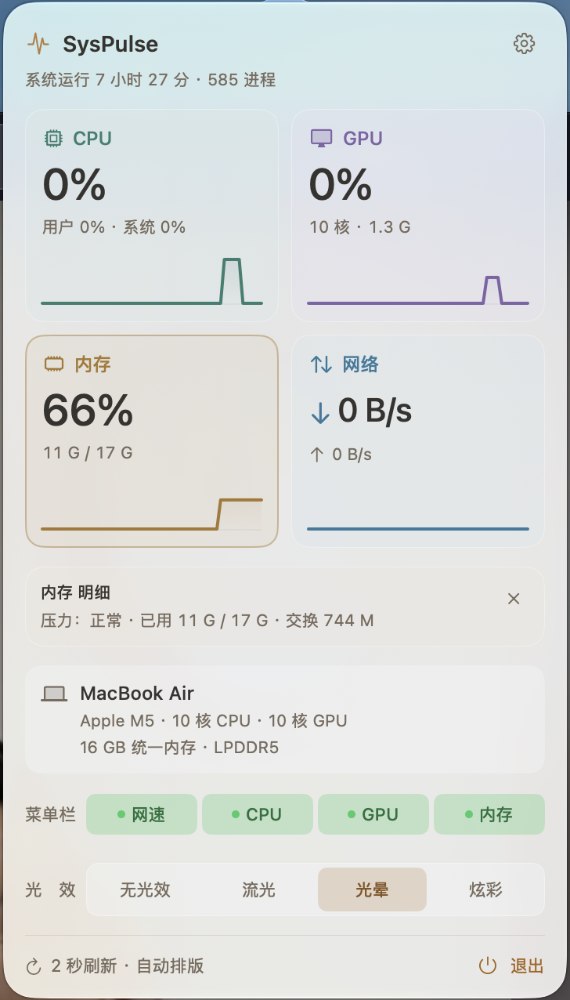
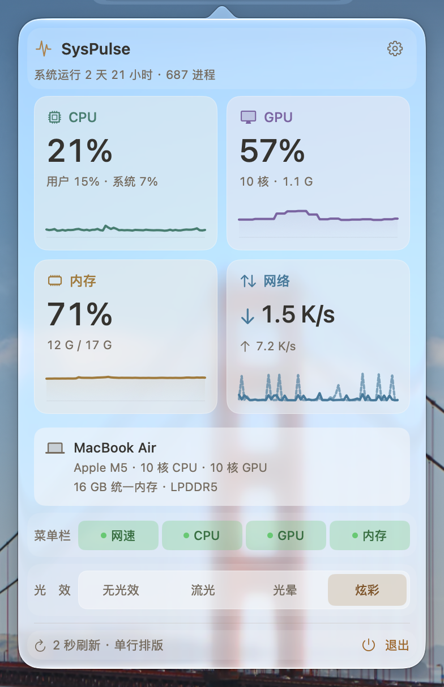

# SysPulse

**macOS 菜单栏实时系统监控**：网速、CPU、GPU、内存，菜单栏看读数，点击查看曲线和详情。

原生 Swift + SwiftUI，无第三方依赖、无网络请求、不收集数据。常驻菜单栏，不占程序坞。

**v1.3.0（2026-10-09）**：齿轮旋转、退出与返回箭头悬停反馈、玻璃通透滑块重做为胶囊玻璃并带跟手轨道动画，开机启动换成滑动开关；状态栏文字层在两次采样之间复用，减少光效期间的重复绘制。详见 [更新记录](<CHANGELOG.md>) 与 [完整更新报告](<docs/UPDATE-v1.3.0.md>)。

<p align="center">
  
  
</p>

主面板与设置页使用 v1.3.0 的真实原生界面截图；内存压力详情示例沿用 v1.1.1。读数、设备信息和玻璃透出的背景随机器与时间变化。

## 下载与安装

**[下载 SysPulse-1.3.0.dmg](https://github.com/orange-ora/SysPulse/releases/download/v1.3.0/SysPulse-1.3.0.dmg)** · [所有版本](https://github.com/orange-ora/SysPulse/releases) · [SHA-256 校验文件](https://github.com/orange-ora/SysPulse/releases/download/v1.3.0/SysPulse-1.3.0.dmg.sha256)

支持 **macOS 14.0+、Apple Silicon 和 Intel**，安装包包含 `arm64` 与 `x86_64` 两种架构，正常运行不需要 Rosetta。

1. 打开 DMG，将 **SysPulse** 拖入 **Applications**。升级时选择“替换”，继续使用 `/Applications/SysPulse.app`。
2. 首次启动，在“应用程序”中右键 **SysPulse → 打开**。若仍被拦截，在“系统设置 → 隐私与安全性”中选择“仍要打开”。
3. 菜单栏出现读数后，推出 **SysPulse 安装盘**。

应用使用 **ad-hoc 签名，未做 Apple 公证**；首次打开可能需要上述系统确认。发布包会校验签名完整性，并附 SHA-256 文件。

没有程序坞图标和 ⌘Tab 条目是菜单栏工具的正常行为。退出请点菜单栏图标，再点面板右下角“退出”。

## 指标面板

- **CPU**：总占用、用户 / 系统占比、核心数和历史曲线。
- **GPU**：驱动提供的利用率、核心数、GPU 内存与曲线；未就绪与机型未提供计数器分别显示。
- **内存**：占用比例、已用 / 总容量、系统内存压力、交换分区与曲线；数字颜色按压力状态告警，与占用比例独立。
- **网络**：下行 / 上行速度、实线 / 虚线双曲线和本次运行累计流量。
- **点击卡片展开详情**：主面板保持紧凑，额外信息按需查看。
- **设备信息**：自动读取当前 Mac 的机型、处理器、CPU / GPU 核心数和物理内存。Apple Silicon 显示统一内存；Intel 在系统提供 DIMM 字段时显示容量与类型组合，不推测未公开的插槽。
- **反光悬浮**：卡片和控件随鼠标倾斜，反光与边缘亮线跟随位置变化；点击范围和布局保持固定，取消立体阴影与整块悬停放大。
- **机器信息彩蛋**：连续点击机器信息栏六下，小电脑轻跳并出现星星和“今天也在努力运行 ✦”；短暂显示后恢复真实信息，不改动指标或设置。

<p align="center">
  
</p>

曲线保留 **60 个采样点**，跨度随刷新周期变化；默认 2 秒刷新时约为 2 分钟。百分比曲线使用固定 0–100% 量程，网络曲线按当前量级显示。

## 显示与外观

右上角齿轮进入独立设置页，可连续调整选项，面板保持打开。

| 选项 | 可选范围 | 新安装 / 恢复默认值 |
| --- | --- | --- |
| 刷新频率 | 0.5 / 1 / 2 / 5 秒 | 2 秒 |
| 菜单栏排版 | 自动 / 单行 / 双行 / 极简 | 自动 |
| 玻璃通透 | 0–100%，厚磨砂到清透玻璃 | 71% |
| 菜单栏光效 | 无光效 / 流光 / 光晕 / 炫彩 | 光晕 |
| 菜单栏指标 | 网速 / CPU / GPU / 内存独立开关 | 全部开启 |

已有有效设置在升级后保留。“恢复显示默认值”只恢复上述显示与外观选项，**不改变开机启动**；首次启动也不会自动注册登录项。开机启动由设置页的系统开关控制。

macOS 26+ 使用原生 **Liquid Glass**；macOS 14 / 15 使用 `NSVisualEffectView` 磨砂回退。通透度只调节背景材质，读数与曲线保持清晰。面板采用浅色外观，菜单栏读数随系统外观变化。

系统开启“减少透明度”时，面板使用实色背景并停用通透滑块。普通按钮带轻微点按反馈，分段选择只有一块底板横向滑动，文字位置保持固定；开启“减少动态效果”时取消缩放与滑动。

显示项使用独立绿色开关；光效四个选项共用一整条底板，与设置页的刷新频率和排版采用相同布局、选中背景与文字颜色。

## 菜单栏

自动排版根据空间在三种密度之间切换；也可在设置页固定选择。以下菜单栏图片均在面板关闭时实拍，数值会随采样变化。

| 排版 | 实际截图 |
| --- | --- |
| 单行 |  |
| 双行 |  |
| 极简 |  |

- 各数值槽按最宽可能值预留空间，读数变化时避免宽度跳动。
- 悬停显示完整指标，包括网络上行速度。
- 所有指标关闭时显示脉搏占位图标。
- CPU 占用达到 80% 变橙、92% 变红。GPU 数字保持正常文字色，百分比和紫色曲线表达负载，高占用不直接代表异常。内存数字按系统压力着色：正常保持原文字色，警告变橙，严重变红；未知使用中性色并在提示中标明。**炫彩模式的菜单栏文字始终保持冷色渐变**，此时请在面板查看告警颜色。

四种光效互斥，动画沿用 10 fps；显示器休眠、锁屏或屏保时自动挂起。

| 光效 | 外观 | 实际截图 |
| --- | --- | --- |
| 无光效 | 普通读数，无持续光效重绘 |  |
| 流光 | 缓慢横移的三色光带 |  |
| 光晕 | 多个彩色光斑独立游走，兼容旧“漫散射”存值 |  |
| 炫彩 | 原生玻璃上的蓝 / 青 / 偏蓝紫文字，珠光沿字面扫过 |  |

<p align="center">
  
</p>

## 数据来源与兼容性

| 指标 | 系统接口 |
| --- | --- |
| CPU | `host_processor_info(PROCESSOR_CPU_LOAD_INFO)`，逐核 tick 差分 |
| GPU | IOKit `IOAccelerator` 的 `PerformanceStatistics` |
| 内存 / 交换分区 | `host_statistics64(HOST_VM_INFO64)` / `sysctl vm.swapusage` |
| 内存压力 | `sysctl kern.memorystatus_vm_pressure_level`，读取系统正常 / 警告 / 严重三态 |
| 网络 | `sysctl(NET_RT_IFLIST2)`，按物理 `en*` 接口计算字节增量 |
| 运行时长 / 进程数 | `systemUptime` / `sysctl KERN_PROC_ALL` |
| 设备信息 | sysctl 回退 + 启动时一次后台 `system_profiler` 查询 |

网速使用十进制单位（`M = 1000²`），统计物理网卡总流量，排除回环、VPN 等虚拟接口以避免重复计数，不按进程拆分。累计流量表示本次应用运行期间可信采样的总量。

GPU 利用率和核心数依赖驱动，部分 Intel 或其他机型可能不提供。缺值会显示等待或不可用，后续有效数据可恢复。Apple Silicon 上的 GPU 内存属于统一内存，不能理解为独立显存。

内存压力读取系统三态，不把占用率或交换容量换算为压力，也不重现活动监视器的压力曲线。该 sysctl 选择器不是 Apple 承诺稳定的公开接口；每轮采样检查读取结果与四字节长度，不支持、读取失败或未知值时明确显示“未知”，不沿用旧告警。

实际运行验证环境为 **Apple M5 / macOS 27.2**。两种架构均完成构建与签名校验；尚未在 Intel 或 macOS 14 / 15 实机完成运行验收。新版玻璃与炫彩的性能没有单独重新测量，旧版开销记录保留在 [开发笔记](<README.dev.md>)，不作为新版性能保证。

## 命令行

应用默认不在 `PATH`，请使用完整可执行路径：

```bash
APP=/Applications/SysPulse.app/Contents/MacOS/SysPulse
"$APP" --dump                  # 指标自检
"$APP" --enable-login-item     # 开启开机启动
"$APP" --disable-login-item    # 关闭开机启动
"$APP" --login-item-status     # 查询登录项
```

## 从源码构建

运行要求 macOS 14.0+；构建需要带 **macOS 26 或更新 SDK** 的 Xcode / 命令行工具，Swift 语言模式为 5。

```bash
git clone https://github.com/orange-ora/SysPulse.git
cd SysPulse
./build.sh                    # 双架构编译、验证、备份、安装并重启
./build.sh --local            # 只生成 dist/SysPulse.app.zip
./build.sh --no-launch        # 安装后不启动
```

正式安装固定在 `/Applications/SysPulse.app`；临时展开包放在不参与索引的目录中，构建结束后清理，回滚备份仅保留压缩归档。`Package.swift` 可用于 IDE 和 SwiftPM，正式打包以 `build.sh` 为准。

发布由版本标签触发，使用 macOS 26 SDK、警告按错误处理的 `arm64` / `x86_64` 构建，校验版本、签名与 DMG，并发布校验文件。

## 验证

```bash
bash Tools/Regression/run.sh
python3 Tools/Regression/BuildPackagingTests.py
bash Tools/PanelProbe/run.sh   # 隔离偏好和登录项的原生界面验证
```

v1.3.0 最终验证通过 **222 项生产断言、24 个控制器场景、52 项玻璃生命周期与反光断言、1 组文字层缓存一致性断言、39 项开合 / 反向 / 代次断言、64 项受控打包检查**。保留 10 种原生面板状态与设置交互，并新增真实指针悬停断言：**153 项原生断言、16 个几何状态**，每个悬停控件都与同页无关区域做对照。双架构发布参数编译与真实指标自检通过；文字层缓存受控对比每帧 0.021 ms → 0.002 ms。具体方法、截图及输入派发限制见 [v1.3.0 更新报告](<docs/UPDATE-v1.3.0.md>)。

v1.2.0 最终验证通过 **222 项生产断言、24 个控制器场景、52 项玻璃生命周期与反光断言、39 项开合 / 反向 / 代次断言、64 项受控打包检查**。保留 10 种原生面板状态与设置交互，并新增 **137 项原生断言与 16 个几何状态**，覆盖真实切页、详情、彩蛋恢复与取消、实际控制器开合 / 收束 / 接收和减少动态效果分支。双架构发布参数编译与真实指标自检通过；具体方法、截图及输入派发限制见 [v1.2.0 更新报告](<docs/UPDATE-v1.2.0.md>)。

v1.1.1 统一验证通过 201 项生产断言（相较 v1.1.0 新增 84 项）、24 个控制器场景、40 项原生玻璃生命周期与帧断言、64 项受控打包检查，以及 10 种原生面板状态和设置交互。新增检查覆盖系统压力映射、失败与恢复、实际面板配色选择，以及两种外观 / 三种排版的菜单栏真实渲染：99% 内存占用且压力正常不告警，40% 占用且压力严重告警，GPU 80% / 100% 保持正常文字色，CPU 仍保留阈值，炫彩仍保留冷色渐变。警告和严重压力通过隔离读取夹具验证，不对本机制造压力。详细范围见 [v1.1.1 更新报告](<docs/UPDATE-v1.1.1.md>)。

v1.1.0 发布时生产回归 117 项断言、24 个控制器场景、40 项原生玻璃生命周期与帧断言以及 64 项受控打包检查通过。点按与横滑另验证普通 / 减少动态效果分支共 20 个原生状态；减少动态效果采用隔离环境键注入，未切换真实系统设置。详细范围见 [更新报告](<docs/UPDATE-v1.1.0.md>)。

## 卸载

先在设置页关闭“开机启动”，再退出应用并删除 `/Applications/SysPulse.app`。命令行方式：

```bash
/Applications/SysPulse.app/Contents/MacOS/SysPulse --disable-login-item
pkill -x SysPulse
rm -rf /Applications/SysPulse.app
rm -f ~/Library/Preferences/com.local.syspulse.plist
```

## 开发与许可

实现决策、历史实测和开发工具说明见 [开发笔记](<README.dev.md>)。Swift 6 语言模式迁移、采样后台化和旧背景光效告警对比度仍有改进空间。

MIT License，详见 [LICENSE](<LICENSE>)。
