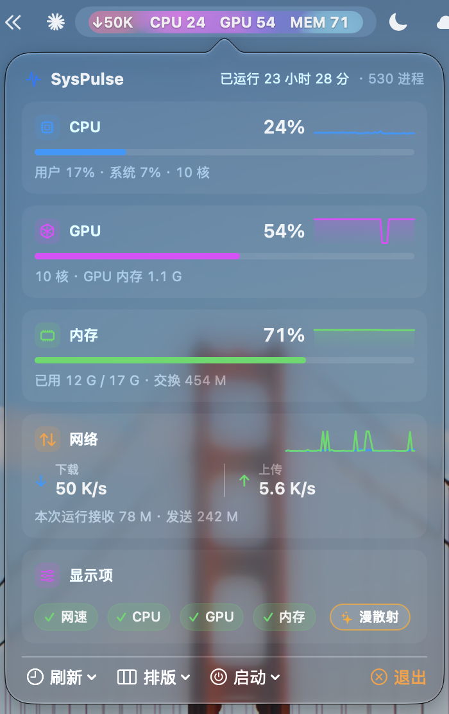
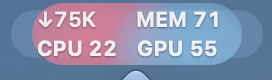
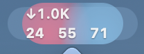
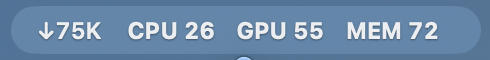

# SysPulse

**macOS 菜单栏实时系统监控** —— 网速、CPU、GPU、内存，一眼看到，点开即详。

原生 Swift + SwiftUI 编写，**零第三方依赖、零网络请求、不收集任何数据**。常驻菜单栏，不占程序坞。

<p align="center">
  
</p>

<p align="center">
  
</p>

---

## 功能

### 菜单栏

- **四项指标**：网络下行、CPU、GPU、内存，用全称标签 `CPU / GPU / MEM`，顺序与面板卡片一致
- **三档自适应排版**：空间够用单行；挤不下自动降到两行带标签；再不够降到极简两行

  **① 单行** —— `↓660B CPU 27 GPU 71 MEM 71`，约 215 pt

  

  **② 两行** —— `↓19K MEM 71` / `CPU 23 GPU 49`，约 110 pt

  

  **③ 极简** —— `↓0B` / `26 83 72`（这一档不带标签，所以 83 会变橙），约 80 pt

  

  > 上面三张是**真实截图**，背景动效为「漫散射」。极简档里 GPU 读数 **83** 显示为橙色，就是下面的压力变色。

- **宽度恒定不跳动**：每段按"最宽可能值"预留槽位（百分比永远占 `100` 的宽度、速度占 `888M`），所以 `↓0B → ↓9.9M`、`CPU 9 → CPU 100` 变化时整条读数**纹丝不动**（27 组取值下漂移 0.0 pt）
- **压力变色**：数值 ≥80% 变橙、≥92% 变红，菜单栏与面板同步
- **悬停提示**：鼠标停在图标上显示完整数值（含上行速度）
- **背景动效**（默认关闭，三选一）：`流光` / `漫散射`，10 fps，显示器休眠 / 锁屏 / 屏保时自动挂起
- **兜底**：指标全关时显示一个脉搏占位图标，不会变成一块找不到的空白

#### 背景动效长什么样

**关闭**（默认，约 0.6% CPU）—— 直接透出菜单栏底色



**流光** —— 一条缓慢横移的三色光带


**漫散射** —— 多个彩色光斑各自游走，互不同步


> 三张是同一台机器的**真实截图**。注意 **GPU 84** 在三种底色下都显示为橙色 —— 这就是压力变色；
> 也正因为动效底色是浅色/彩色的，橙红告警字的对比度问题才暴露出来（见「已知限制」）。

### 下拉面板

点击菜单栏图标展开：

- **CPU** —— 总占用、用户 / 系统占比、核心数、最近 60 秒曲线
- **GPU** —— 利用率（驱动 `Device Utilization %`，与活动监视器同源）、核心数、曲线
- **内存** —— 占用比例、已用 / 总量、交换分区、曲线
- **网络** —— 下行 / 上行速度、双线曲线、本次运行累计流量
- 底部工具栏：**刷新频率**（0.5 / 1 / 2 / 5 秒）、**排版**、**开机自启**、**退出**
- **指标开关卡片**：四个小开关 + 一个背景效果胶囊，可随手连点

### 命令行

SysPulse 是 `.app` 包，**不在 `PATH` 里**，所以要带完整路径调用：

```bash
APP=/Applications/SysPulse.app/Contents/MacOS/SysPulse

"$APP" --dump                  # 打印一次全部指标（自检 / 排查用）
"$APP" --enable-login-item     # 开启开机自启
"$APP" --disable-login-item    # 关闭开机自启
"$APP" --login-item-status     # 查询开机自启状态
```

`--dump` 不需要图形界面，可以在终端里直接确认采集是否正常。

**想直接用 `SysPulse` 这个名字？** 建一个软链接即可（需要管理员密码）：

```bash
sudo ln -s /Applications/SysPulse.app/Contents/MacOS/SysPulse /usr/local/bin/SysPulse
```

之后 `SysPulse --dump` 就能用了。

`--dump` 输出示例：

```
=== SysPulse 指标自检 ===
CPU         : 25.7%  (用户 17.0% / 系统 8.7%, 10 核)
GPU         : 81.0%  显存 1.3 G
内存        : 72.5%  已用 12 G / 17 G  交换 454 M
网络下行    : 996 B/s
网络上行    : 996 B/s
本次运行流量: 接收 1.0 K / 发送 1.0 K
运行时长    : 23 小时 18 分
进程数      : 527
状态栏预览  : ↓996B  CPU 26%  GPU 81%  MEM 72%
```

---

## 安装

### 方式一：下载 DMG（最简单）

**直接下载最新版 → [`SysPulse-1.0.0.dmg`](https://github.com/orange-ora/SysPulse/releases/download/v1.0.0/SysPulse-1.0.0.dmg)** （1.7 MB）

1. 点上面的链接下载（也可以到 [Releases](../../releases) 页面挑版本）
2. 双击打开 DMG，把 **SysPulse** 拖进 **Applications**
3. **首次打开请用右键** —— 在「应用程序」里**右键点 `SysPulse` → 打开**，弹窗里再点一次「打开」

   > 只需要这一次。之后就能正常双击启动。
   >
   > 如果右键菜单里没有出现「打开」按钮，去 **系统设置 → 隐私与安全性**，往下滚到
   > 「已阻止使用“SysPulse”」，点 **仍要打开**。

4. 启动后菜单栏就会出现读数，**没有程序坞图标**

   > **这是有意设计，不是装坏了。** SysPulse 是菜单栏工具：`Info.plist` 里
   > `LSUIElement = true`，代码里再调一次 `setActivationPolicy(.accessory)`，
   > 所以它只活在菜单栏里，不进程序坞、也不出现在 ⌘Tab 切换器中。
   >
   > 由此带来两个需要注意的地方：
   > - **退出**：点菜单栏图标 → 面板右下角 **退出**。
   >   ⌘⌥Esc 的「强制退出」窗口里**找不到它**，必要时用 `pkill -x SysPulse`。
   > - **卸载前先关掉开机自启**（面板里的「启动」菜单），否则会留下一个指向已删除
   >   App 的启动项。

<details>
<summary><b>为什么会被拦一下？</b></summary>

SysPulse 用 **ad-hoc 临时签名** 打包，没有购买 Apple 开发者证书（$99/年）做签名与公证。
macOS 因此无法确认「这个 App 是谁发布的」，会拦一道。

这是 Apple 的安全机制，**不是 App 本身有问题**：

- 签名完整性已验证通过（`codesign --verify --deep --strict` 返回 `valid on disk` +
  `satisfies its Designated Requirement`）
- 全部源码公开在本仓库，可自行审查
- 无网络请求、不收集数据

想彻底消除这道提示，只有购买 Apple 开发者证书并做公证一条路。
</details>

<details>
<summary>兜底：命令行方式（绝大多数人用不上）</summary>

只有当 macOS 把 App 判定为「**已损坏，无法打开**」时（而不是「身份不明的开发者」），
才需要清除隔离属性：

```bash
xattr -dr com.apple.quarantine /Applications/SysPulse.app
```

判断依据：`codesign --verify --deep --strict /Applications/SysPulse.app` 若返回
`valid on disk`，说明签名完好，用上面的右键方法即可，**不需要跑这条命令**。
</details>


### 方式二：从源码构建（推荐给开发者）

**环境要求**：macOS 14.0+，Xcode 命令行工具

```bash
xcode-select --install     # 如果还没装
```

```bash
git clone git@github.com:orange-ora/SysPulse.git
cd SysPulse
./build.sh
```

`build.sh` 会自动完成：编译 → 打包成通用二进制（arm64 + x86_64）→ 安装到 `/Applications/SysPulse.app` → 重启 App。

其他用法：

```bash
./build.sh --local       # 只打包到本目录 dist/，不安装
./build.sh --no-launch   # 安装但不自动启动
```

### 方式三：Swift Package Manager

```bash
git clone git@github.com:orange-ora/SysPulse.git
cd SysPulse
swift build -c release
```

> ⚠️ 本项目的正式构建走 `build.sh`（直接调 `swiftc`）。`Package.swift` 是给 IDE 和 `swift build` 用的便利入口，编译参数与 `build.sh` 不完全等价（比如未显式钉住 `-swift-version 5`）。日常开发请用 `build.sh`。

---

## 卸载

```bash
# 先退出 App（菜单栏图标 → 退出，或）
pkill -x SysPulse
rm -rf /Applications/SysPulse.app
# 偏好残留（可选）
rm -f ~/Library/Preferences/com.local.syspulse.plist
```

如果开了开机自启，建议先在面板里关掉，或：

```bash
/Applications/SysPulse.app/Contents/MacOS/SysPulse --disable-login-item
```

---

## 开销

在 Apple M5 / macOS 27 上实测（每档 12~20 秒均值）：

| 状态 | CPU | 常驻内存 |
|---|---|---|
| 效果关闭 · 面板关闭 | **0.61%** | 46.4 MB |
| 流光 (10fps) · 面板关闭 | **9.62%** | 46.5 MB |
| 漫散射 (10fps) · 面板关闭 | **9.54%** | 46.4 MB |
| 效果关闭 · 面板打开 | ~1.2% | 84.2 MB |
| 漫散射 · 显示器休眠 / 锁屏 | **0.64%** | 46.3 MB |

几点说明：

- 同一台机器不同轮次之间有 ±1% 上下漂移，要看的是**相对关系**（关闭 ≪ 流光 ≈ 漫散射），不是绝对值。
- 面板打开后多出的约 38 MB 由 AppKit 持有，**开过一次面板就不会归还** —— 这是系统行为，不是内存泄漏。
- 动效那约 9% 的开销，本质是"**每帧把状态栏项内容换成一张新图**"的系统代价（系统要为内容变化重跑布局 + 菜单栏重组），与图片大小无关。实测：图像宽度 80 pt vs 229 pt → 9.93% vs 9.59%；相位冻结（定时器照跑、内容不变）→ 0.86%。而 SysPulse 自己那部分绘制只占 **0.13 ms/帧**，比这笔系统开销便宜约 70 倍。
- **10 fps 是量化选出来的拐点**，不是拍脑袋：漫散射每帧变化在 10 fps 时是 0.669%（约 1.7 个 8 位灰阶），到 24 fps 左右就低于 1 个灰阶（≈0.39%）—— 画面根本表达不出这么小的变化，多出来的帧在重复同一个颜色；而 CPU 是线性翻倍的（10 fps 9.54% → 20 fps 18.70%）。

> 想要接近 0 的开销？**保持背景效果为「关闭」**（默认值）。

---

## 数据来源

所有指标都直接用 macOS 内核 / 系统框架接口采集，与「活动监视器」同源：

| 指标 | 采集方式 |
|---|---|
| CPU | `host_processor_info(PROCESSOR_CPU_LOAD_INFO)`，逐核 tick 差分 |
| GPU | IOKit `IOAccelerator` 服务的 `PerformanceStatistics` → `Device Utilization %` |
| 内存 | `host_statistics64(HOST_VM_INFO64)`（活跃 + 联动 + 压缩页）；交换分区来自 `sysctl vm.swapusage` |
| 网络 | `sysctl(NET_RT_IFLIST2)` 读网卡字节计数器并差分 |
| 运行时长 / 进程数 | `systemUptime` / `sysctl KERN_PROC_ALL` |

**网速口径**：

- 单位是**十进制** MB/s（`M` = 1000²，所以 `↓2.8M` ≈ 22 Mbps）
- 只统计物理接口 `en*`，**排除** `lo0` / `utun*`（VPN）/ `awdl*`，避免重复计数
- 统计整块网卡的全部流量，**不区分进程**
- 显示的是**本次运行期间**的累计流量 —— 内核给出的累计值不可信（见下）

---

## 工程结构

```
SysPulse/
├── Sources/SysPulse/          # 源码（13 个文件，约 3000 行）
│   ├── main.swift             # 入口、命令行参数
│   ├── AppDelegate.swift
│   ├── StatusItemController.swift  # 状态栏项 + 面板控制 + 升降档状态机
│   ├── MenuBarImage.swift     # 菜单栏图片全自绘（含两个背景动效）
│   ├── DashboardView.swift    # SwiftUI 面板
│   ├── Monitors.swift         # CPU / GPU / 内存 / 网络 / 进程 采集
│   ├── SystemMonitor.swift    # 采样调度 + 历史曲线
│   ├── PanelAnchorAnimation.swift  # 面板位移动画
│   ├── Preferences.swift      # UserDefaults 偏好
│   ├── SingleInstance.swift   # 文件锁单实例
│   ├── LaunchAtLogin.swift    # SMAppService 开机自启
│   ├── Formatting.swift       # 数值格式化
│   └── Debug.swift            # --dump 自检
├── Tools/                     # 开发辅助工具（各自独立可编译）
│   ├── CPUSpy/                # 量自身开销
│   ├── Clicker/               # 合成鼠标点击
│   ├── NetSpy/                # 核对网速口径
│   ├── StatusProbe/           # 真实渲染面板截图
│   ├── VerifyArrow/           # 列出窗口真实 frame
│   ├── LayoutProbe/           # 量三档排版宽度
│   ├── MakeIcon.swift         # 生成 App 图标
│   └── GPUStress.swift        # Metal 加压验证 GPU 读数
├── Resources/                 # Info.plist、图标、设计对照图
├── build.sh                   # 构建脚本（纯 swiftc）
├── Package.swift              # SwiftPM 清单
└── README.dev.md              # 开发笔记（原 README，含全部踩坑记录）
```

---

## 技术亮点

这个项目的复杂度几乎全部来自"**把菜单栏 App 的边界条件做对**"。几个值得一提的点：

**1. 菜单栏图片完全自绘，而不是用 `attributedTitle`**

两个理由：① macOS 状态栏项**一旦跨过刘海区域就完全不会绘制**（进程还活着、`isVisible` 仍是 true、frame 也正常，但屏幕上什么都没有），必须自己精确控制宽度才能避让；② 每段按"最宽可能值"预留槽位，数值变化时宽度恒定，读数不会左右跳动。

**2. 三档排版 + 刘海避让的完整状态机**

把"系统不绘制跨进刘海禁区的状态栏项"这个**未文档化行为**量化成了具体边界：窗口左边缘要落在安全区起点再往右约 40 pt 之后。据此设计了升降档判据 —— 降档看最近 2 拍、升档看最近 5 拍取最大、换档后 2 秒冷却，且升档判据看的是"**升档后的左边缘**"而不是"当前档的余量"（后者会误判：两行档余量看着够，升到单行后左边缘会落到画不出来的区域）。

**3. 面板锚点预测定位**

系统在菜单栏换档时会**分两段**改窗口（先改宽度、约 15~30 ms 后再改 x），并且在改宽度那一刻就用「旧 x + 新宽度」把面板摆错一次（实测偏 45 pt）。修法利用了"**换档前后状态栏窗口右边缘守恒**"（实测恒为 1224）来预测最终位置，在系统摆错的**同一轮 runloop 内**抢先纠正 —— 错误位置累计从 218.5 ms / 被观测到 8 次，降到 12.1 ms / **0 次**。

**4. 两个自研背景动效**

macOS 14 上没有现成积木（`MeshGradient` 要 macOS 15、`.glassEffect` 要 macOS 26），所以用 `NSGradient` + 径向渐变手写。`漫散射` 的效果是 2~5 个径向光斑各自沿不同方向、周期、色相游走。

**5. 休眠 / 锁屏按来源分别记账**

`Set<String>` 而不是一个 `Bool` —— 因为条件会**重叠**（锁屏之后显示器再休眠 = 两次挂起，但唤醒时只来一条恢复通知）。用单个布尔值会把标志清成 false 就以为没事了，而屏还锁着。**集合空了才算真的恢复。**

**6. 注释即证据链**

几乎每个非显然的决策都带实测数字、对照实验，以及"试过但没用"的方案及排除原因。比如"字号 +1 会让单行从 213 变成 229 pt"、"`NSAnimationContext` 设 0.15/0.30/0.60 秒实测都是 588~603 ms，所以对 `NSPopover` 完全无效"。

**7. 构建指纹**

`build.sh` 把 git 短哈希 + 是否 dirty + 构建时刻写进打包后的 `Info.plist`（必须在 `codesign` 之前），一条命令就能确认"装的到底是不是新版本"：

```bash
defaults read /Applications/SysPulse.app/Contents/Info CFBundleVersion
defaults read /Applications/SysPulse.app/Contents/Info SysPulseBuildStamp
```

> 完整的技术笔记、全部踩坑记录、以及每一项的实测数据，都在 [README.dev.md](README.dev.md)（约 1200 行）。

---

## 环境要求

- **运行**：macOS 14.0 (Sonoma) 或更高
- **构建**：Xcode 命令行工具（`xcode-select --install`）

已在 **macOS 27.2 + Apple M5** 上验证。

---

## 已知限制

- **橙 / 红告警字在动效底色上对比度不足** —— 实测红字只有 1.0~2.0 : 1（WCAG AA 要求 4.5 : 1）。把颜色调暗也救不回来，需要描边或暗底这类字形处理，**尚未实现**。背景效果关闭时无此问题。
- **面板打开时状态栏项会多出一块"选中底色"** —— 这是 macOS 给状态栏项画的效果（控制中心、Wi-Fi 等系统图标点开时同样如此）。试过 `highlight(false)` 无效，属系统行为。
- **档位判定的"拍"等于刷新周期** —— 2 秒刷新时降档约需 4 秒、升档约 2 秒；5 秒刷新时相应翻倍。判定本身其实不需要新数据（只读状态栏窗口横坐标），但改进方案评估后未实施。
- **采样在主线程** —— 最贵的 GPU 采样已节流到每 4 拍一次（实测 961.6 µs/次，是最贵的一项），目前开销可接受，但把采样挪到后台队列是更稳妥的架构。
- **Swift 6 迁移是已知技术债** —— 有几处非并发安全的全局状态（`Preferences.shared`、`MenuBarImage.slotWidthCache` 等），切到 Swift 6 语言模式会报 12 个错误。所以 `build.sh` 显式钉住了 `-swift-version 5`。
- **面板窗口约 38 MB 不归还** —— 开过一次面板后由 AppKit 持有，换掉弹窗对象也回收不了，是系统行为。

---

## 许可

MIT License，详见 [LICENSE](LICENSE)。
