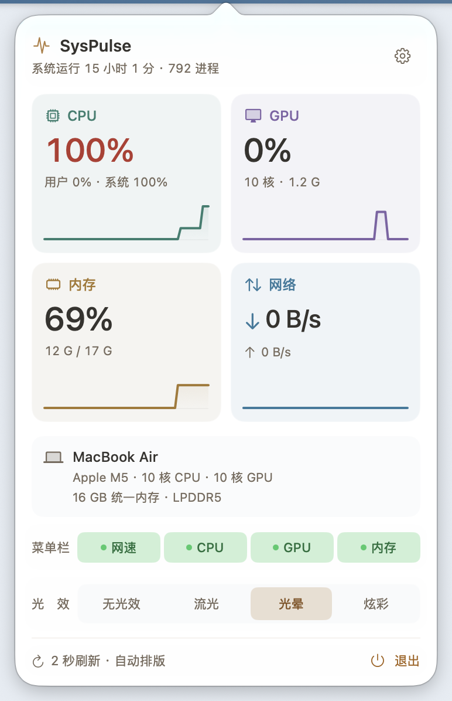
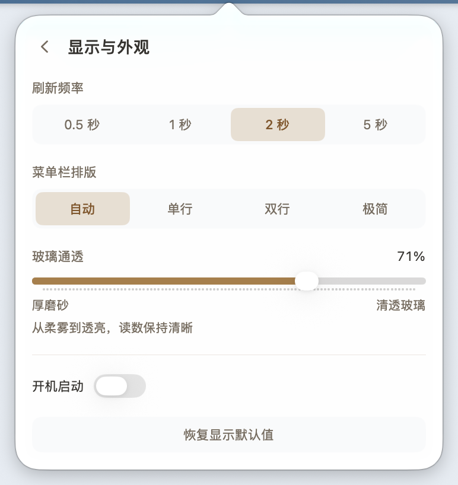

# SysPulse v1.2.0 更新报告

发布日期：2026-10-08。本版集中更新面板与菜单栏交互：统一无阴影的反光悬浮，重做向下展开与轻量回收，修正设置页自然高度，并加入机器信息点击彩蛋。指标采样、告警依据和已有偏好沿用 v1.1.1。

## 反光悬浮

CPU、GPU、内存、网络、设备信息、标题、底部条带和设置控件现在用跟随鼠标的背景反光、方向性边缘亮线与倾斜表现悬浮。取消原来的立体阴影和整块悬停放大，减少内容随阴影合成与缩放产生的发虚感。

指标卡片保留各自识别色，显示项仍使用绿色开关。设备和指标卡片采用较明显的倾斜；两页最后一张卡片也增加倾斜幅度，标题和小控件按实际尺寸适配。固定点击范围和正文布局不跟随视觉变换，按钮按压反馈、分段选中底板滑动继续保留。

菜单栏流光、光晕和炫彩长条同步采用反光、边缘亮线与轻微倾斜，取消悬浮阴影与放大。无光效仍保持静态，原背景光效节奏、数值槽宽和自动排版规则不变。

本版没有给文字直接增加模糊。整块内容仍会随倾斜产生透视变化；反光悬浮并不承诺透视下的字边与静止状态完全相同。菜单栏原有字形对比度处理继续保留。

## 展开、回收与菜单栏接收

面板仍向下展开，打开约 0.22 秒。关闭约 0.24 秒，向菜单栏轻量收束：宽度最多收窄 12%，正文纵向最多轻缩 6%，有间隙时上移不超过 8 pt。正文保留完整自然尺寸，外层窗口和裁切视口驱动实际开合；中途反向从当前状态衔接。

关闭完成时，菜单栏长条出现一次小幅接收回弹。接收、鼠标悬浮和横向布局动画使用独立路径，保持系统点击区域与字号。原有横向同步过渡统一为约 0.14 秒。

开启系统“减少动态效果”后，取消空间动效，保留静态颜色和反光反馈。睡眠、锁屏和屏保继续挂起菜单栏光效。

## 连续材质与自然布局

箭头与面板正文共用一层覆盖原生弹窗轮廓的材质，沿用玻璃通透度、浅色面板与减少透明度设置。正文宽度仍为 360 pt、内边距仍为 14 pt。

修正设置页沿用总览页高度的问题：当前页面直接发布实际自然尺寸，设置页按自身内容收缩，返回总览后恢复总览高度。开合期间暂存尺寸变化，结束后消费最新测量，避免旧宿主尺寸覆盖新页面。

右上角设置齿轮保持在标题右侧、上下居中。原有指标详情、显示开关、告警颜色与设置行为保持。

## 机器信息彩蛋

点击机器信息栏，小电脑图标会轻压回弹并扩散一圈淡光。连续点击时每两下亮起一个光点；约三秒内累计六下，触发小跳和三颗星星，短暂显示“今天也在努力运行 ✦”，随后恢复真实内存信息。

停点后充能自然消退，庆祝具有短暂冷却，持续猛点不会堆叠庆祝动画。切页或关闭清理当前效果与延迟任务。彩蛋不改变系统指标、显示偏好或开机启动状态。

## 实际界面

界面截图使用本版真实原生面板；指标、设备信息和玻璃透出的背景随机器与时间变化。

## 验证范围

- **222 项生产断言**通过，保留 v1.1.1 的 201 项检查，新增 21 项真实自然尺寸容器与测量中转验证，覆盖合并、像素取整、开合暂存 / 恢复、旧尺寸拒绝与弱绑定隔离。
- 原有 **24 个控制器场景**通过；**52 项玻璃视图生命周期与悬浮图层断言**通过，包括移除立体阴影和整块放大、反光跟随指针、固定点击区及关闭 / 挂起清理。这些玻璃检查使用真实离屏视图。
- **39 项开合、反向与代次断言**通过，执行提取的真实生产算法，覆盖收束幅度、过期显示帧 / 回调拒绝、快速点击与减少动态效果；窗口和显示帧为隔离夹具。
- **64 项受控打包检查**通过，覆盖备份、回滚、签名失败清理、标签与版本一致性、发布说明和校验文件生成，使用当前发布工作流及虚拟版本验证插值。
- 保留原有 **10 种原生 NSPopover 状态与设置交互**；新增 **137 项原生断言、16 个几何状态**通过。覆盖正常 / 减少动态两组真实切页、四指标详情、刷新 / 排版选项、隔离登录项和恢复默认、彩蛋出现 / 恢复 / 超时 / 切页取消、旧庆祝任务隔离。
- 实际生产控制器在隔离进程中验证真实打开 / 关闭、顶沿固定、宽高收束、中途重开恢复和菜单栏 `panel.receipt` 图层动画；减少动态效果分支立即完成并无接收空间动画。总览正文 **360 × 571.5 pt**、设置 **360 × 382.5 pt**，外框宽约 **386 pt**、高约 **598 → 409 → 598 pt**，指标详情正文约 **634.5 pt**。普通开合每轮记录 32 次打开、34 次关闭采样：打开宽固定 386 pt、高约 144 → 598 pt；关闭宽约 386 → 340 pt、高约 598 → 125 pt，接收动画确实出现。减少动态效果的同样采样保持完整 386 × 598 pt，并不出现接收空间动画。
- 卡片悬浮使用实际指针移动和 WindowServer 图像差异验证；菜单栏自定义反光使用原生 `NSEvent` tracking 回调验证实际图层。当前系统托管状态栏没有分发测试合成的 CG 鼠标移动，因此没有将该路径记为物理菜单栏鼠标端到端验收。
- `arm64` 与 `x86_64` 均以 **Swift 5、macOS 14 目标、`-O -wmo -warnings-as-errors`**完成发布参数编译，真实 `--dump` 自检通过。

验证不修改正式应用偏好或真实登录项。减少动态效果通过 probe 进程内读取替换与原生通知驱动，不切换真实系统设置。截图来自隔离原生验证，在中性底窗前按实际弹窗 frame 捕获，包含箭头与玻璃，不包含外围页面文字。

实际运行环境为 **Apple M5 / macOS 27.2**，本机 SDK **27.0**，发布 CI 使用 macOS 26 SDK。`arm64` 与 `x86_64` 均以 macOS 14、Swift 5 为目标构建；Intel 和 macOS 14 / 15 尚无实机运行验收。时序与几何检查不等同于跨设备帧率或整机性能保证。

## 获取更新

下载 [SysPulse-1.2.0.dmg](https://github.com/orange-ora/SysPulse/releases/download/v1.2.0/SysPulse-1.2.0.dmg) 与 [SHA-256 校验文件](https://github.com/orange-ora/SysPulse/releases/download/v1.2.0/SysPulse-1.2.0.dmg.sha256)。支持 macOS 14.0+、Apple Silicon 与 Intel 通用包；采用 ad-hoc 签名，未做 Apple 公证，首次打开方式见 [安装说明](<../README.md#下载与安装>)。

升级时替换 `/Applications/SysPulse.app`，保留已有显示偏好和开机启动状态。版本标签为 `v1.2.0`，旧版本及其附件继续保留。
