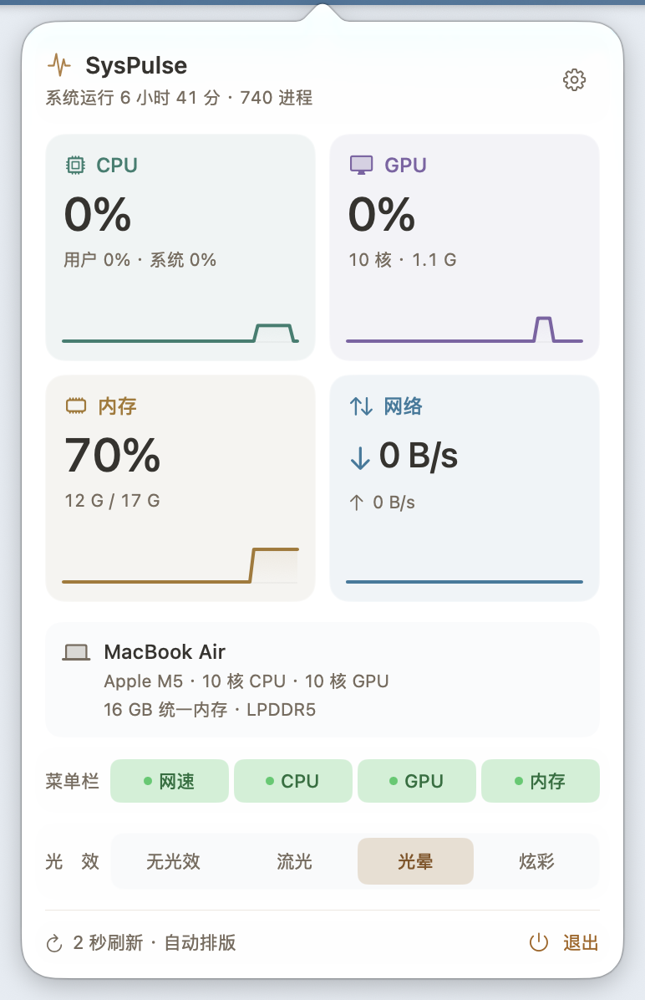
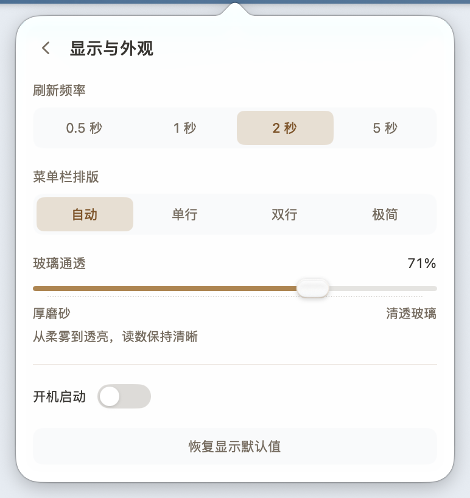

# SysPulse v1.3.0 更新报告

发布日期：2026-10-09。本版集中更新面板控件的显示动效，并减少状态栏在动效期间的重复绘制。指标采样、告警依据、菜单栏光效与已有偏好沿用 v1.2.0。

## 设置入口与退出按钮

右上角齿轮悬停时淡入浅色底板，同时自身旋转 45°，移开时按同一条曲线平滑转回。底部“退出”悬停时淡入警示色底板。两处底板由负内边距抵消体积，齿轮位置、退出按钮占位与整页布局都不移动，点击区域和原有按压反馈保持原样。

底板淡入用 `easeOut`，进 0.16 秒、出 0.24 秒；齿轮旋转用 `smooth(0.42)`，起止都留了余量，不会出现停住的感觉。

## 玻璃通透滑块

滑块改为自绘，外观与开机启动的滑动开关同属一套语言，但材质是玻璃。滑钮是比高度更宽的胶囊（27 × 16 pt），靠四层叠加表现通透：

- **本体**：白到面板浅灰的三段纵向渐变，上亮下沉；
- **顶部聚光**：上部弧形高光，让胶囊看起来被上方光打亮；
- **底部内阴影**：1.4 pt 描边，模拟玻璃的厚度与折射沉降；
- **外沿折射线**：顶部纯白、底部透出强调色，形成玻璃边缘的亮线。

四层全部由同一个 `scale` 驱动，放大时不会有一层脱节。滑钮悬停约 1.08 倍、按下约 1.14 倍，接地阴影随放大同步加深，键盘聚焦时描边转为强调色。

轨道保持原有 4 pt 厚度，鼠标触及或拖动时轻微增厚（4 → 5 → 5.8 pt）、底色加深、已填充段转实、下方刻度点变清楚；三段动画各自收敛（0.20 / 0.16 / 0.23 秒），滑钮位置始终跟手，拖动期间不插值。轨道下方保留原生滑块的点状刻度，用单条虚线路径绘制，不增加视图层级。

无障碍沿用原生 `Slider` 表示：角色、范围、步长与数值朗读和改动前一致，方向键仍可微调 0.01。

## 返回箭头与开机启动开关

设置页左上角返回箭头悬停时向左轻移 1.6 pt 并放大到 1.08 倍。帧尺寸固定 23 × 24 pt，只改绘制位置与缩放，标题行和整页高度不受影响。

开机启动换成面板内滑动开关：44 × 20 pt 轨道、16 pt 白色圆钮，悬停时圆钮轻微放大、阴影加深。`Toggle` 的标签与无障碍语义全部保留。

## 减少动态效果

开启系统“减少动态效果”后，位移、缩放、旋转与轨道增厚全部取消，滑钮、圆钮与轨道固定在静止数值上，只保留底板淡入与颜色变化。所有动效都以 `reduceMotion ? nil : …` 单独短路，不依赖上层是否已经禁用。

## 状态栏文字层复用

菜单栏光效以 10 fps 驱动，而数据每 2 秒才刷新一次。此前动效的每一拍都会重新渲染文字层，并把新图交给状态栏按钮、触发一次状态栏重新布局，而两次数据刷新之间这些动作画出来的像素完全相同。

现在文字层按「采样时间戳 + 档位 + 外观 + 光效 + 四个显示开关」缓存，同一份采样直接复用上一张 `NSImage`，赋值前先比较对象身份。缓存的键包含光效类型，所以切换光效会立即重画；**炫彩**的字形随相位变化，不参与缓存，仍每拍重绘。提示文字改为只由采样时间戳决定，同一份采样不再反复写入。

受控对比（同一份采样、同一个真实状态栏按钮，只切换缓存开关，2400 帧、预热两轮后取第三轮、连测三次）结果一致。复现工具为 `Tools/TextCacheBench/main.swift`，它复现的是缓存判定分支，并非直接调用私有的 `textImage`：

| 路径 | 每帧耗时 |
| --- | --- |
| 每拍重画并赋新图 | 0.0215 ms |
| 同采样复用缓存 | 0.0022 ms |

每帧省下约 0.019 ms（约 **90%**），等效 10 fps 下每秒约 0.19 ms。绝对量不大，但它去掉的是每拍一次文字光栅化加一次状态栏重排，而不是少画几个像素。回归中另有断言比对缓存图与重新渲染的 `tiffRepresentation`，两者的 TIFF 编码**逐字节一致**；背景光效、图标与数值槽宽度均未改动。

## 实际界面

界面截图使用本版真实原生面板；指标、设备信息和玻璃透出的背景随机器与时间变化。

## 验证范围

- **222 项生产断言**通过，保留 v1.2.0 的全部检查。
- 原有 **24 个控制器场景**通过；**52 项玻璃视图生命周期与悬浮图层断言**通过；另有 1 组独立的文字层缓存一致性断言（同一采样复用同一张图、缓存图与新鲜渲染的 TIFF 编码逐字节一致、新采样必须重画、炫彩每次重画）。这些检查使用真实离屏视图与真实渲染器。
- **39 项开合、反向与代次断言**通过，执行提取的真实生产算法；窗口与显示帧为隔离夹具。
- **64 项受控打包检查**通过，覆盖备份、回滚、签名失败清理、标签与版本一致性、发布说明和校验文件生成。
- 原生探针 **153 项实质断言、16 个几何状态**通过。本轮新增真实指针悬停断言，使用 WindowServer 图像差异在控件局部区域内比较悬停前后的渲染结果，普通与减少动态两组各覆盖齿轮、退出、滑块、开机启动四项；每项同时比较同一页面上另一块不受影响的区域，**八次对照全部为 0**，说明变化确实来自被悬停的控件，而不是整页重绘或光标闪烁。悬停差异幅度：齿轮 0.0308 / 0.0087（普通 / 减少动态）、退出 0.0650 / 0.0270、滑块 0.0144 / 0.0033、开机启动 0.0062 / 0.0018，全部高于 0.0001 的判定阈值。
- 布局与改动前一致：总览正文 **360 × 571.5 pt**、设置正文 **360 × 382.5 pt**，外框 **386 × 598 pt** / **386 × 409 pt**；探针 `layout.txt` 中总览与设置两页的尺寸行与改动前相同，说明本轮只改绘制、未改占位。
- `arm64` 与 `x86_64` 均以 **Swift 5、macOS 14 目标、`-O -wmo -warnings-as-errors`**完成发布参数编译，`lipo` 通用包架构为 `x86_64 arm64`，真实 `--dump` 自检通过。

验证不修改正式应用偏好或真实登录项。减少动态效果通过探针进程内读取替换与原生通知驱动，不切换真实系统设置。截图来自隔离原生验证，在中性底窗前按实际弹窗 frame 捕获。

实际运行环境为 **Apple M5 / macOS 27.2**，本机 SDK **27.0**，发布 CI 使用 macOS 26 SDK。`arm64` 与 `x86_64` 均以 macOS 14、Swift 5 为目标构建；Intel 和 macOS 14 / 15 尚无实机运行验收。时序与几何检查不等同于跨设备帧率或整机性能保证。

## 获取更新

下载 [SysPulse-1.3.0.dmg](https://github.com/orange-ora/SysPulse/releases/download/v1.3.0/SysPulse-1.3.0.dmg)，打开后把 SysPulse 拖入“应用程序”。升级不会改动已有显示与外观设置，也不改动开机启动。

回到 [README](<../README.md>) 或 [更新记录](<../CHANGELOG.md>)。
