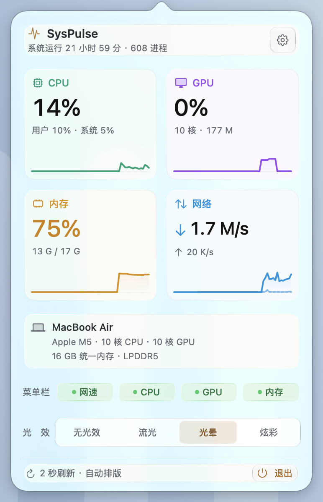
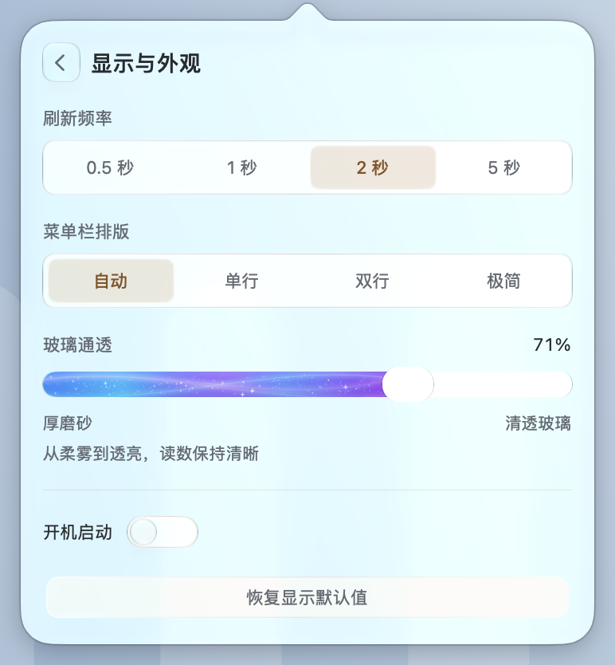
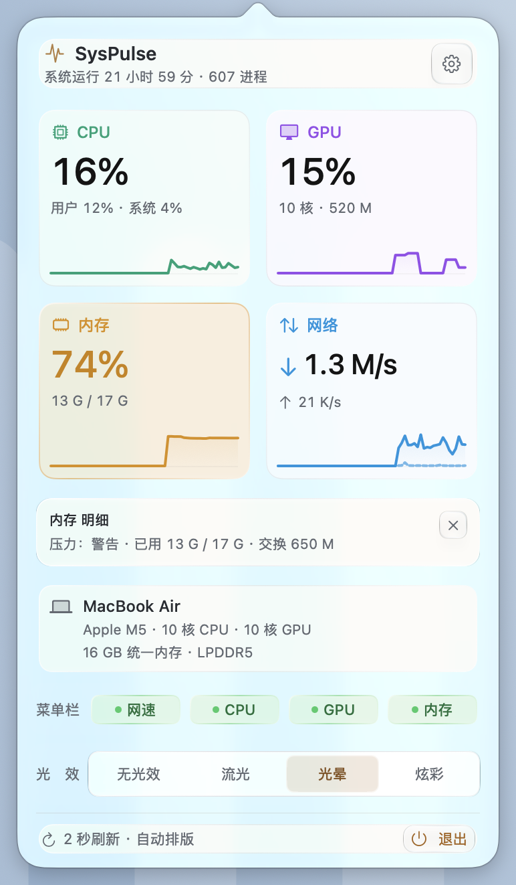
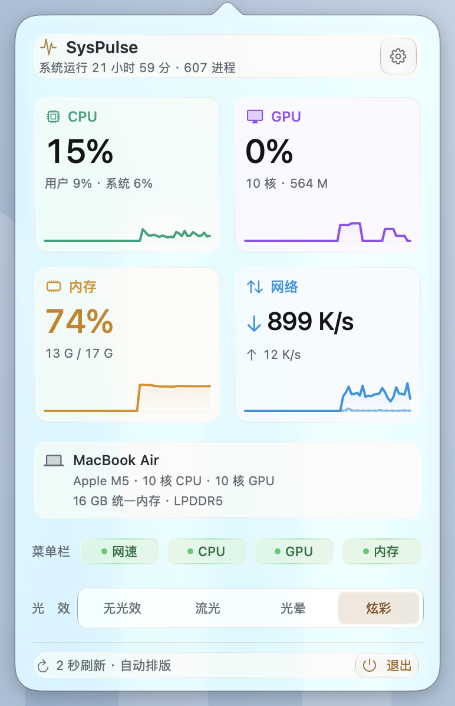

# SysPulse v1.4.0 更新报告

发布日期：2026-10-10。本版改善玻璃面板的稳定性与读数清晰度，重做详情展开和星点通透滑条，并增加 GPU 独立占用率告警。

## 更稳定的原生玻璃

指标卡片、设备信息、标题与底部操作栏使用统一的轻微支撑和反光反馈。文字、裁切轮廓与玻璃保持同一姿态，修正悬停时出现的黑色合成块、文字脱离底板及追踪区域反复进出造成的抖动。点击范围和卡片自然尺寸保持固定，没有整块悬停放大或额外立体阴影。

标题与运行时间靠左、设置入口靠右，底部退出按钮的间距与边框对齐；移动到齿轮或退出等内嵌按钮上时，所属卡片仍能连续跟踪指针。

## 更顺滑的详情展开与收起

点击 CPU、GPU、内存或网络卡片时，详情显露、下方内容位置与真实窗口高度由同一条时间线驱动。完整行程约 0.24 秒，短余程保留最小衔接时间；中途收起、重新展开或切换指标会沿当前状态继续。

修复此前展开开始、收起结束时整页突然跳动的问题。原生详情宿主保持稳定，正文贴齐顶部，布局尺寸在合适的阶段一次性交接，避免系统提交临时的窗口位置。最终验证记录 WindowServer 的实际窗口边界与正文位置，四项详情在普通、减少动态效果及实色回退分支都保持固定上沿。

整窗开合的轻量收束、菜单栏接收反馈与横向位置衔接继续保留。

## 交织星点玻璃通透滑条

“玻璃通透”轨道加厚到 16 pt，滑钮为 32 × 22 pt 的无色胶囊玻璃。已选区域使用更鲜亮的蓝紫与青色交织底色，减弱白雾覆盖，并保留细薄的珠光层次。颜色按实际滑钮轮廓切开，不给滑钮额外染色；玻璃仍可能自然透出背景颜色。

流动物质改为更多、更小的星点与短流光，每颗星点有不同的速度、相位和回转方向。选中或键盘聚焦时，流动速度平滑加快；拖动会在滑钮附近扬起星尘、带起局部流动并短暂闪亮，来回拖动也能持续响应，松手后自然衰减。

鼠标点选、拖动、方向键微调和数值保存继续保留，步长仍为 1%。系统开启“减少动态效果”时星点静止并取消空间动画；开启“减少透明度”时采用实色回退，通透滑条禁用。

## 更鲜明的指标与大数字

四张卡片的标题、左侧图标和折线同步提亮：

| 指标 | 识别色 |
| --- | --- |
| CPU | 鲜亮青绿 |
| GPU | 紫罗兰 |
| 内存 | 琥珀金 |
| 网络 | 湖蓝 |

大数字独立使用不偏蓝的中性近黑色，告警黄、红也更纯净。文字本身没有降低透明度，也没有叠加模糊或渐变；辅助小字和设置控件继续沿用原配色。

## GPU 的 92% / 97% 告警

GPU 面板大数字及普通菜单栏数值新增独立阈值：

| GPU 原始利用率 | 数字颜色 |
| --- | --- |
| 低于 92% | 正常文字色 |
| 92% 至不足 97% | 黄色 |
| 97% 及以上 | 红色 |

这是按 GPU 利用率提示高负载，与系统内存压力状态无关。阈值按原始采样值判断，显示百分比继续四舍五入。GPU 缺值仍区分等待与不可用，不保留旧告警。

CPU 继续使用 80% / 92% 阈值，内存数字继续按系统压力正常 / 警告 / 严重状态着色。炫彩模式的菜单栏文字继续保持冷色渐变，此时可在面板查看告警颜色。

## 新版实际界面

四张截图使用本版生产视图、真实指标采样和真实 NSPopover，由隔离探针在受控背景前拍摄；通透度为默认 71%，不是效果图。设备信息、数值及玻璃透出的背景随机器和时间变化。截图进入版本控制，并由 README 与本次发布公告引用；旧版本化截图保留历史原貌。

## 最终回归与验证边界

- **259 项生产断言**通过，覆盖采样、偏好、登录项模拟、内存压力、GPU 告警、菜单栏渲染和面板测量。GPU 阈值与实际黄 / 红字形另通过 **75 项专项检查**；这 75 项属于生产回归的相关子集，不重复计入总数。
- **24 个控制器场景、52 项玻璃生命周期 / 图层断言、12 项反光检查、1 组文字缓存一致性检查、39 项开合 / 反向 / 代次断言**通过。反光检查包含在玻璃检查的覆盖中，不作为互不重叠的总和。
- **64 项受控打包检查**通过，覆盖签名失败、备份恢复、安装回滚、唯一安装路径、标签与版本一致性，以及公告 / 截图 / 校验文件生成。
- **628 项原生界面断言、24 个几何状态**通过，另保留 10 种初始面板状态与设置点击验证。覆盖固定命中区域、标题与底部悬停、玻璃黑块、四项详情连续开合、起止位置、快速反向、彩蛋恢复 / 取消、真实生产控制器开合与辅助设置分支。
- 滑条专项 **25 项断言**通过，验证真实 0% / 50% / 100% 点击、连续拖动、方向键 1% 步长、减少动态效果下星点完全静止及减少透明度下禁用输入；动画所有权交接专项 **17 项断言**通过，覆盖开窗中点击、详情与整窗交接、切设置页后返回及恢复高度。另保存详情动画中段的原生截图用于裁切检查。
- 双架构候选归档的 `arm64` / `x86_64`、1.4.0 版本、全架构严格签名和包内真实 `--dump` 指标自检通过。GitHub 发布继续使用 macOS 26 SDK、Swift 5、macOS 14 目标及警告按错误处理的双架构构建。

总览正文为 **360 × 571.5 pt**，设置正文为 **360 × 390.5 pt**，详情展开为 **360 × 634.5 pt**。本机原生外框分别为 **386 × 598 pt**、**386 × 417 pt**、**386 × 661 pt**；设置页因轨道加厚比上一版高 8 pt。

本次还同步了测试夹具：隔离控制器提取新增的真实 GPU 告警函数；动态滑条的悬停与复原检查比较静态滑钮轮廓，避免把持续流动的星点误认为悬停故障。减少动态效果时仍比较整条静态滑条。黄 / 红字形检查以主要色相区分，允许少量抗锯齿边缘混色。

所有回归使用隔离偏好与登录项模拟，不修改真实登录项。减少动态效果与减少透明度通过探针进程内读取替换及通知验证，没有切换系统全局设置。当前探针不能展开 SwiftUI AX 树，因此方向键与真实鼠标调节已验证，但未将 VoiceOver 朗读与调节宣称为完成运行验收。

实际运行环境为 **Apple M5 / macOS 27.2**，本机 SDK **27.0**。Intel 与 macOS 14 / 15 仍未完成实机运行验收；双架构编译不能替代跨设备体验验证。星点动效的整机功耗没有单独重新测量，不沿用旧版性能数字作为保证。

## 获取更新

下载 [SysPulse-1.4.0.dmg](https://github.com/orange-ora/SysPulse/releases/download/v1.4.0/SysPulse-1.4.0.dmg)，打开后把 SysPulse 拖入“应用程序”，升级时选择“替换”。安装包为 Apple Silicon / Intel 通用包，要求 macOS 14.0+；采用 ad-hoc 签名、未做 Apple 公证，首次打开方式见 [安装说明](<../README.md#下载与安装>)。

已有有效显示偏好与开机启动状态继续保留，采样来源及菜单栏自动排版规则不变。随包提供 [SHA-256 校验文件](https://github.com/orange-ora/SysPulse/releases/download/v1.4.0/SysPulse-1.4.0.dmg.sha256)。

回到 [README](<../README.md>) 或 [更新记录](<../CHANGELOG.md>)。
